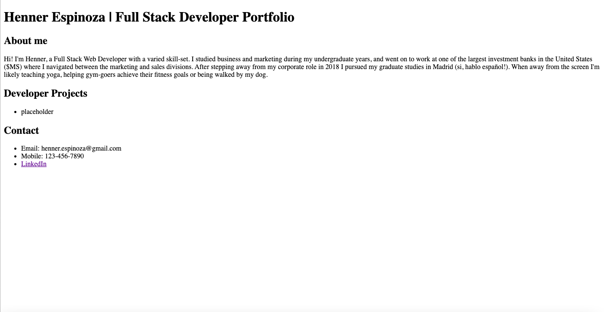
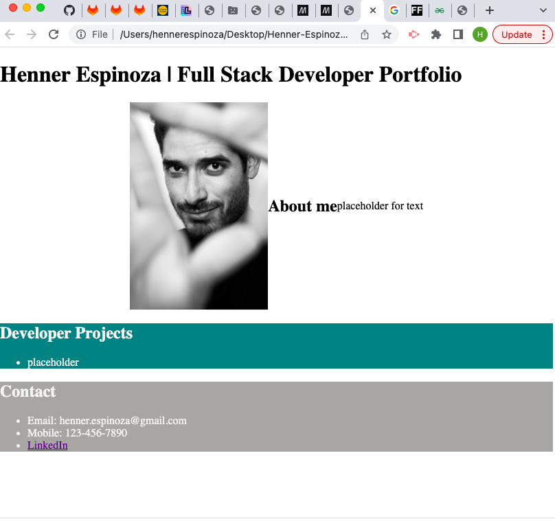
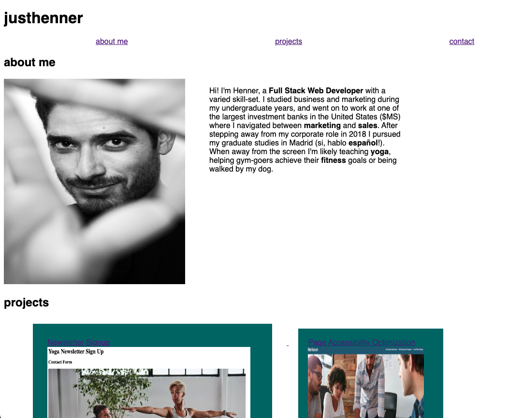

# Henner-Espinoza-Full-Stack-Developer-Portfolio

## Technology Used

HTML                https://developer.mozilla.org/en-US/docs/Web/HTML
CSS                 https://developer.mozilla.org/en-US/docs/Web/CSS
Github              https://www.github.com
Chrome Dev Tools    https://developer.chrome.com/docs/devtools/

## Description

This repository and deployed project contain Henner's full stack developer portfolio including an about me section, projects and contact. 

### Phase 1

### Phase 2

### Phase 3 (live)

## Usage

Click on the 'about me', 'projects' and 'contact' in order to navigate to each section. 

Click the project title to navigate to its microsite.

## Learning Points
1. Links sometimes need to be closed out with '< /a>'
2. The stylesheet can be added using the following format (mind the '.' and '/') "assets/css/style.css"
3. Images can be added using the following format (mind the '.' and '/'): "assets/images/filename.jpg"
4. I was unable to get a working link onto the 'Flexbox Design' title without the link erroneously tagging itself to all other items in the contact section. Note: The current link format in line 48 of index.html was obtained through AskBCS. Please advise on this. 
5. I was unable to get a max-height set on '.container p'. See line 44 of stylesheet and advise please.   

## Author Info

Henner E. Espinoza

LinkedIn: https://www.linkedin.com/in/hennerespinoza/
Github: @justhenner

## Credits

AskBCSLearningAssistant